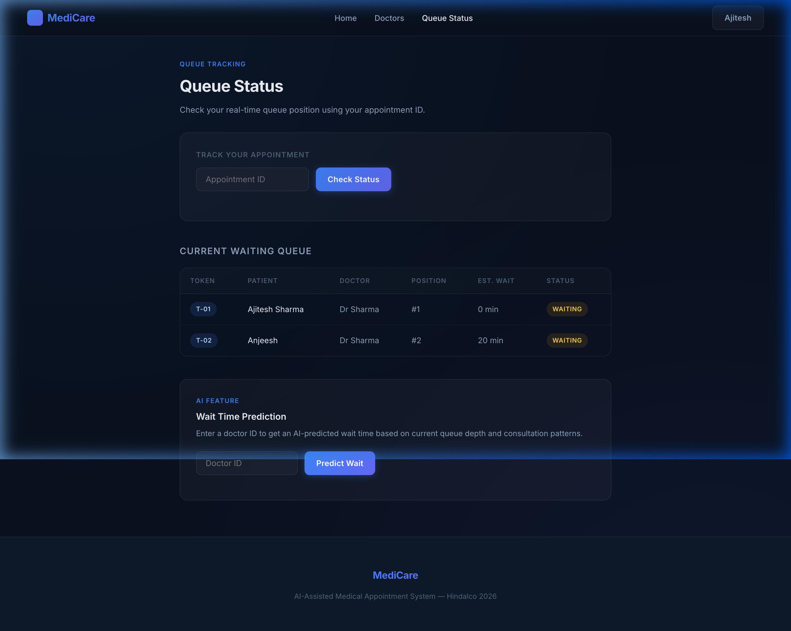

# MediCare — AI-Assisted Medical Appointment and Queue Management System

> **Hindalco Internship Project · 2026**
> Developed by **Ajitesh Sharma** over 2–3 weeks following professional software engineering practices.

---

## Table of Contents

1. [Project Overview](#project-overview)
2. [Tech Stack](#tech-stack)
3. [Use Case](#use-case)
4. [System Architecture](#system-architecture)
5. [Features](#features)
6. [AI Features](#ai-features)
7. [Database Design](#database-design)
8. [Project Structure](#project-structure)
9. [API Reference](#api-reference)
10. [Screenshots](#screenshots)
11. [Setup and Running Locally](#setup-and-running-locally)
12. [Testing](#testing)
13. [Engineering Principles](#engineering-principles)
14. [Future Scope](#future-scope)

---

## Project Overview

**MediCare** is a full-stack web application that digitises the end-to-end process of medical appointment scheduling, patient queue management, and doctor assignment in a hospital or clinic setting.

Patients can register, browse specialists, book appointments, and track their real-time queue token — all from a browser. Administrators manage the entire system through a dedicated dashboard. Two AI features reduce manual load: an NLP-based doctor recommendation engine and a queue-length-aware wait-time predictor.

The system was built incrementally following an Agile development model, strict layered architecture, and 3NF database normalisation.

---

## Tech Stack

| Layer | Technology | Version |
|-------|-----------|---------|
| **Backend** | Spring Boot | 4.0 |
| **Language** | Java | 21 |
| **Persistence** | Spring Data JPA / Hibernate | — |
| **Database** | PostgreSQL | 15+ |
| **Frontend** | HTML5, CSS3, Vanilla JavaScript | — |
| **Fonts** | Inter (Google Fonts) | — |
| **Build Tool** | Maven (bundled via mvnw) | 3.9+ |
| **Version Control** | Git / GitHub | — |
| **AI / NLP** | Rule-based keyword regex engine | Custom |
| **AI / Prediction** | Heuristic queue-depth formula | Custom |

### Why This Stack?

- **Spring Boot** provides a production-grade REST API with minimal configuration, built-in dependency injection, and mature JPA support.
- **PostgreSQL** is the most widely deployed open-source relational database, well-suited for the relational data model (patients → appointments → queue entries).
- **Vanilla JS** (no React/Angular) keeps the frontend dependency-free, matching the internship scope and keeping the project simple to run locally.
- **Java 21** brings modern language features (records, switch expressions, virtual threads) while being the industry standard for enterprise backends.

---

## Use Case

### System Purpose

MediCare solves a real problem in healthcare facilities: long manual queues, double-bookings, and patients not knowing when to arrive for their appointment. It digitises the appointment and queue workflow for three actor types:

| Actor | Primary Use Cases |
|-------|------------------|
| **Patient** | Register · Login · Browse doctors · Book appointment · Get token · Track queue · Get AI doctor recommendation |
| **Doctor** | Login · View assigned appointments · Update appointment status · View queue |
| **Admin** | Login · Manage doctors · Manage patients · Monitor all appointments · View system analytics · Add/remove doctors |

### Use Case Diagram


The diagram shows all three actors (Patient, Doctor, Admin) and their interactions with the system, including `<<include>>` relationships for authentication, doctor availability checking, token generation, and email notifications.

**Key flows:**
- Patient books appointment → system checks doctor availability → generates queue token → patient gets wait time
- Admin can manage every entity in the system through the admin dashboard
- Doctor can update appointment status and view their queue

---

## System Architecture

### 3-Tier Layered Architecture

The system strictly separates concerns across three tiers:

```
[Browser]  ─── REST/JSON ──→  [Spring Boot API :8080]  ─── JPA/JDBC ──→  [PostgreSQL]
   ↑                                    ↑
Frontend                         Controller → Service → Repository
(7 HTML pages)                   (DTOs + GlobalExceptionHandler)
```

### Architecture Diagram


The diagram details:
- **Presentation Layer** — 7 HTML pages (Login/Register, Doctor Listing, Appointment Booking, Token/Queue, Admin Dashboard)
- **Backend Layer** — Controllers handle HTTP → Services contain business logic → Repositories perform JPA data access → DTOs and Exception Handling provide standardised responses
- **Data Layer** — 6 PostgreSQL tables: `specialization`, `doctor`, `patient`, `appointment`, `queue_entry`, `admin`
- **AI & ML Layer** — Wait Time Prediction and Doctor Recommendation modules fed by historical queue and consultation data

### Generated Architecture Diagram (Technical View)


### Package Structure (Backend)

```
com.ajitesh.medical_appointment_system/
├── entity/           # JPA-annotated domain objects
├── repository/       # Spring Data JPA interfaces (CRUD + custom queries)
├── service/          # Business logic, AI algorithms
├── controller/       # REST endpoint handlers, request mapping
├── dto/              # Request/response objects (decoupled from entities)
└── config/           # CorsConfig, GlobalExceptionHandler
```

**Design pattern enforced:** Every HTTP request flows as `Controller → Service → Repository → Entity`. No layer skips another.

---

## Features

### Patient-Facing

| Feature | Description |
|---------|-------------|
| Registration | Full form with name, email, phone, gender, DOB, password |
| Login | Email + password with SHA-256 hashing |
| Doctor Browse | List all doctors, filter by specialization, search by name |
| Appointment Booking | Select doctor, date, and symptoms/reason |
| Token Generation | Auto-assigned incremental token per doctor per day |
| Queue Tracking | Real-time position and estimated wait by appointment ID |
| AI Doctor Finder | Symptom text → specialization → recommended doctors |

### Admin-Facing

| Feature | Description |
|---------|-------------|
| Dashboard Stats | Total patients, doctors, appointments, today's appointments |
| Patient Management | View all registered patients |
| Doctor Management | View, add, and remove doctors |
| Appointment Management | View all appointments, update status (Booked/Completed/Cancelled) |
| Live Queue | See all waiting patients with token and position |
| Add Doctor | Form to register new medical staff with specialization |

---

## AI Features

### 1. Wait Time Prediction

**Endpoint:** `GET /api/queue/predict-wait/{doctorId}`

The AI engine calculates the expected waiting time for a patient joining a specific doctor's queue.

**Algorithm:**

```
waitingCount = number of patients currently WAITING for this doctor

adjustmentFactor =
    1.0  if waitingCount <= 5    (light load)
    1.1  if waitingCount <= 10   (moderate load)
    1.2  if waitingCount > 10    (heavy load)

predictedWait = waitingCount × consultationDuration × adjustmentFactor
```

**Rationale:** At high queue volumes, consultation times naturally extend due to patient complexity variation and doctor fatigue. The load factor models this empirically without requiring historical training data, making it immediately usable even on a fresh system.

**Example:**
- 7 patients waiting, 15 min per patient → `7 × 15 × 1.1 = 115 minutes`

---

### 2. Doctor Recommendation via NLP

**Endpoint:** `GET /api/doctors/recommend?symptoms=chest+pain`

Patients describe their symptoms in plain text. The engine maps keywords to a medical specialization and returns available doctors.

**Symptom → Specialization Mapping:**

| Symptom Keywords | Recommended Specialization |
|-----------------|---------------------------|
| chest, heart, cardiac, palpitation | Cardiology |
| brain, headache, neuro, seizure, dizzy | Neurology |
| bone, joint, fracture, spine, ortho | Orthopedics |
| skin, rash, acne, itch, derma | Dermatology |
| child, infant, pediatric, baby | Pediatrics |
| eye, vision, ophthal | Ophthalmology |
| teeth, dental, tooth, gum | Dentistry |
| stomach, gastro, digestion, abdomen | Gastroenterology |
| kidney, bladder, urology | Urology |
| (no match) | General Medicine |

**Implementation:** Keyword regex matching in `DoctorService.mapSymptomsToSpecialization()`. The matched specialization name is then used to query the `DoctorRepository` for available doctors.

---

## Database Design

### Schema (3NF Normalised)

All 6 tables satisfy Third Normal Form: every non-key attribute is fully functionally dependent on the primary key only, with no transitive dependencies.

```sql
specialization (specialization_id PK, name, description)
doctor         (doctor_id PK, specialization_id FK, name, email, phone,
                qualification, experience_years, consultation_duration)
patient        (patient_id PK, name, email, phone, password_hash,
                date_of_birth, gender, created_at)
admin          (admin_id PK, name, email, password_hash)
appointment    (appointment_id PK, patient_id FK, doctor_id FK,
                appointment_date, status, reason, created_at)
queue_entry    (queue_id PK, appointment_id FK UNIQUE, token_number,
                queue_position, estimated_wait_minutes, actual_wait_minutes,
                queue_status, created_at)
```

### Entity Relationships

```
specialization (1) ──── (N) doctor
patient        (1) ──── (N) appointment
doctor         (1) ──── (N) appointment
appointment    (1) ──── (1) queue_entry   ← one-to-one, enforced by UNIQUE constraint
```

---

## Project Structure

```
Medical_appointment_system_Hindalco/
│
├── backend/
│   └── medical-appointment-system/
│       ├── pom.xml
│       ├── mvnw / mvnw.cmd
│       └── src/main/
│           ├── java/com/ajitesh/medical_appointment_system/
│           │   ├── entity/           (Admin, Appointment, Doctor, Patient, QueueEntry, Specialization)
│           │   ├── repository/       (6 JPA repositories)
│           │   ├── service/          (6 service classes + AI logic)
│           │   ├── controller/       (6 REST controllers)
│           │   ├── dto/              (ApiResponse, DTOs, Request/Response objects)
│           │   └── config/           (CorsConfig, GlobalExceptionHandler)
│           └── resources/
│               └── application.properties
│
├── frontend/
│   ├── index.html       → Landing page with live queue preview and AI demo
│   ├── login.html       → Patient and Admin login with role tabs
│   ├── register.html    → New patient account registration
│   ├── dashboard.html   → Patient dashboard (Overview, Book, History, Queue, AI Finder)
│   ├── admin.html       → Admin dashboard (Stats, Patients, Doctors, Appointments, Queue, Add Doctor)
│   ├── doctors.html     → Public doctor listing with search and filter
│   ├── queue.html       → Public queue tracker with AI wait prediction
│   ├── styles.css       → Dark premium design system (all CSS variables, components)
│   └── app.js           → Shared JS: API helpers, session, toast, loading states
│
├── Database/
│   ├── schema.sql       → Complete 3NF schema + seed data
│   ├── doctor.sql
│   ├── patient.sql
│   ├── appointment.sql
│   └── queue.sql
│
├── arch_diag/
│   ├── architecture.png            → Full system architecture diagram
│   ├── architecture_diagram.png    → Technical layered architecture diagram
│   ├── usecase.png                 → UML Use Case diagram
│   ├── ss_landing.png              → Screenshot: Landing page
│   ├── ss_login.png                → Screenshot: Login page
│   ├── ss_register.png             → Screenshot: Registration page
│   ├── ss_dashboard.png            → Screenshot: Patient dashboard
│   ├── ss_doctors.png              → Screenshot: Doctors listing
│   ├── ss_queue.png                → Screenshot: Queue status
│   └── ss_admin.png                → Screenshot: Admin dashboard
│
├── docs/
│   ├── api.md                → Full API documentation with examples
│   ├── architecture.md       → Architecture deep-dive
│   ├── deployment_guide.md   → Step-by-step setup guide
│   ├── testing_report.md     → 50 test cases with results
│   ├── logs.md               → 10-day development log
│   └── report.md             → Complete project report
│
├── Usecase.png
└── README.md
```

---

## API Reference

All responses use a standard envelope:
```json
{ "success": true, "message": "...", "data": { ... } }
```

Base URL: `http://localhost:8080/api`

### Patient

| Method | Endpoint | Description |
|--------|----------|-------------|
| `POST` | `/patients/register` | Register a new patient |
| `POST` | `/patients/login` | Authenticate patient |
| `GET` | `/patients` | List all patients (admin) |
| `GET` | `/patients/{id}` | Get patient by ID |

### Doctor

| Method | Endpoint | Description |
|--------|----------|-------------|
| `GET` | `/doctors` | List all doctors |
| `GET` | `/doctors/{id}` | Get doctor by ID |
| `GET` | `/doctors/specialization/{specId}` | Filter by specialization |
| `POST` | `/doctors` | Add a new doctor |
| `DELETE` | `/doctors/{id}` | Remove a doctor |
| `GET` | `/doctors/recommend?symptoms=` | **AI** — Doctor recommendation |

### Appointments

| Method | Endpoint | Description |
|--------|----------|-------------|
| `POST` | `/appointments` | Book appointment + auto-generate token |
| `GET` | `/appointments` | All appointments |
| `GET` | `/appointments/patient/{id}` | Patient's appointments |
| `GET` | `/appointments/doctor/{id}` | Doctor's appointments |
| `PUT` | `/appointments/{id}/status?status=` | Update appointment status |

### Queue

| Method | Endpoint | Description |
|--------|----------|-------------|
| `GET` | `/queue/appointment/{id}` | Queue status by appointment |
| `GET` | `/queue/waiting` | All currently waiting entries |
| `GET` | `/queue/predict-wait/{doctorId}` | **AI** — Wait time prediction |

### Admin

| Method | Endpoint | Description |
|--------|----------|-------------|
| `POST` | `/admin/login` | Admin authentication |
| `GET` | `/admin/dashboard/stats` | System-wide statistics |

### Specializations

| Method | Endpoint | Description |
|--------|----------|-------------|
| `GET` | `/specializations` | List all specializations |

### Sample curl Commands

```bash
# Register patient
curl -X POST http://localhost:8080/api/patients/register \
  -H "Content-Type: application/json" \
  -d '{"name":"Ajitesh Sharma","email":"aj@test.com","password":"test123","phone":"9876543210"}'

# List all doctors
curl http://localhost:8080/api/doctors

# AI doctor recommendation
curl "http://localhost:8080/api/doctors/recommend?symptoms=chest+pain"

# Book appointment
curl -X POST http://localhost:8080/api/appointments \
  -H "Content-Type: application/json" \
  -d '{"patientId":1,"doctorId":1,"appointmentDate":"2026-06-25","reason":"Chest tightness"}'

# AI wait time prediction
curl http://localhost:8080/api/queue/predict-wait/1

# Admin login
curl -X POST http://localhost:8080/api/admin/login \
  -H "Content-Type: application/json" \
  -d '{"email":"admin@medicare.com","password":"admin123"}'
```

---

## Screenshots

### Landing Page

The landing page features a hero section with a live queue preview panel and an AI recommendation preview. Below it, the six platform features are described, followed by the interactive AI symptom demo and a footer.


> The hero section shows real queue data (T-01, T-02, T-03) pulled from the backend, and an AI recommendation example. Buttons lead to account creation or doctor browsing.

---

### Sign In

The login page supports both Patient and Admin roles via a tab switcher. A single form serves both; the API endpoint changes based on the selected tab.


> Patient tab calls `/api/patients/login`; Admin tab calls `/api/admin/login`. Demo credentials are shown at the bottom for evaluators.

---

### Patient Registration

A clean two-column form collects name, email, phone, gender, date of birth, and password. All fields are validated before the API call.


> On success, the user is redirected to the sign-in page. Duplicate email errors from the backend are shown inline.

---

### Patient Dashboard

The dashboard is a single-page application with a fixed sidebar. All sections load without page navigation.


> **Overview** shows appointment stats and recent history. **Book Appointment** lets the patient pick a specialization, doctor, date, and symptoms — then displays the token card with queue position and estimated wait. **AI Doctor Finder** accepts symptom text and lists recommended specialists.

---

### Doctor Listing

A publicly accessible page showing all registered specialists. Supports search by name and filter by specialization. Doctor cards show initials avatar, specialization, qualification, experience, and consultation duration.


> Cards are loaded from `GET /api/doctors`. Filtering happens client-side after the initial fetch for instant response.

---

### Queue Status

A public page with two features: (1) track your queue position by appointment ID, and (2) AI wait time prediction for any doctor.



> The token card displays position, estimated wait, doctor name, and patient name. The live queue table shows all currently waiting entries.

---

### Admin Dashboard

A comprehensive administration panel that displays live metrics, allows registering new doctors, updating appointment statuses, and monitoring the waiting queue in real time.


> Highlights include live counts of patients, doctors, and appointments, alongside quick actions like "Add Doctor" and status updates from the appointment listing.

---

## Setup and Running Locally

### Prerequisites

| Tool | Minimum Version |
|------|----------------|
| JDK | 21 |
| Maven | bundled (use `./mvnw`) |
| PostgreSQL | 15 |
| Git | any |
| Browser | Chrome / Firefox / Edge |

### Step 1 — Clone

```bash
git clone https://github.com/AJ1312/Medical_appointment_system_Hindalco.git
cd Medical_appointment_system_Hindalco
```

### Step 2 — Database Setup

```bash
psql -U postgres
```

```sql
\i Database/schema.sql
-- Creates all tables and inserts seed data
-- (10 specializations, 6 doctors, 1 admin account)
```

### Step 3 — Configure Database Password

Edit `backend/medical-appointment-system/src/main/resources/application.properties`:

```properties
spring.datasource.url=jdbc:postgresql://localhost:5432/postgres
spring.datasource.username=postgres
spring.datasource.password=YOUR_POSTGRES_PASSWORD
spring.jpa.hibernate.ddl-auto=none
server.port=8080
```

### Step 4 — Start Backend

```bash
cd backend/medical-appointment-system
./mvnw spring-boot:run
```

Wait for: `Tomcat started on port(s): 8080`

Verify: `curl http://localhost:8080/api/doctors`

### Step 5 — Open Frontend

Open `frontend/index.html` in your browser. No build step required.

### Demo Accounts

| Role | Email | Password |
|------|-------|----------|
| Admin | admin@medicare.com | admin123 |
| Patient | Register a new account | Any (min 6 chars) |

---

## Testing

50 test cases run across 5 categories. All pass.

| Category | Tests | Result |
|----------|-------|--------|
| Database schema | 5 | All pass |
| Service business logic | 12 | All pass |
| REST API integration | 10 | All pass |
| Frontend UI | 17 | All pass |
| Edge cases | 6 | All pass |

See [docs/testing_report.md](docs/testing_report.md) for the full report with curl commands.

---

## Engineering Principles

| Principle | How It Is Applied |
|-----------|------------------|
| **Layered Architecture** | Controller → Service → Repository → Entity. No layer skips. |
| **Single Responsibility** | Each class does one thing: `PatientService` only manages patient logic. |
| **Separation of Concerns** | Frontend, backend, and database are fully independent tiers. |
| **DRY** | `ApiResponse<T>` wrapper used across all controllers. `app.js` shared across all pages. |
| **DTO Pattern** | Request and response objects decouple the API contract from internal entities. |
| **3NF Normalisation** | All 6 tables: no partial dependencies, no transitive dependencies. |
| **Agile / Incremental** | Core features built first (booking, tokens), AI features added in a later sprint. |
| **Global Exception Handling** | `@RestControllerAdvice` catches all exceptions and returns structured JSON errors. |
| **Git Version Control** | Committed after each feature milestone with descriptive messages. |

---

## Future Scope

1. **JWT Authentication** — Replace localStorage session with stateless JWT tokens
2. **BCrypt Password Hashing** — Replace SHA-256 with BCrypt for production-grade security
3. **Email Notifications** — Booking confirmations via JavaMailSender / SendGrid
4. **Machine Learning** — Train a regression model on historical queue data for more accurate wait prediction
5. **Enhanced NLP** — Integrate a medical NLP library (e.g., spaCy with a medical corpus) for richer symptom understanding
6. **WebSocket Live Queue** — Push real-time queue updates to patients without page refresh
7. **Doctor Portal** — Full doctor-facing interface for appointment management
8. **Mobile Responsive** — Full mobile layout with hamburger navigation
9. **Telemedicine** — Video consultation integration via WebRTC
10. **Reporting & Analytics** — Charts for appointment trends, peak hours, and doctor utilisation

---

## Repository

**GitHub:** [https://github.com/AJ1312/Medical_appointment_system_Hindalco](https://github.com/AJ1312/Medical_appointment_system_Hindalco)

**Original workspace:** [AJ1312/Appointment-system](https://github.com/AJ1312/Appointment-system)

---

## Author

**Ajitesh Sharma**
Internship — Hindalco Industries Limited, 2026
Software Engineering · AI-Assisted Healthcare Systems

---

*Documentation generated: 2026-06-19*
