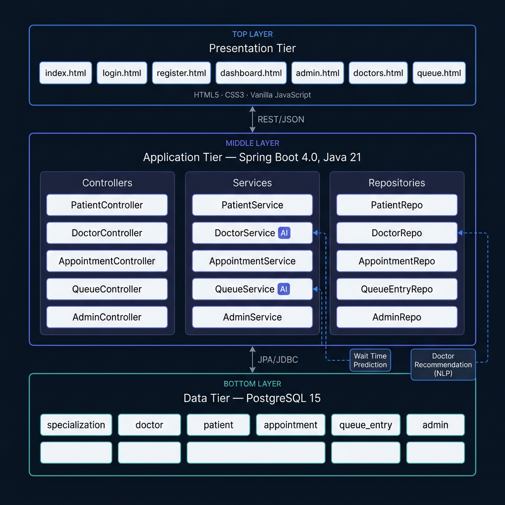

# Project Report
## MediCare – AI-Assisted Medical Appointment and Queue Management System

**Institution:** Hindalco Industries Limited (Internship Project)
**Author:** Ajitesh Sharma
**Duration:** 2026-06-01 to 2026-06-19 (2–3 Weeks)
**Repository:** https://github.com/AjiteshSharma/Medical_appointment_system_Hindalco

---

## 1. Executive Summary

MediCare is a full-stack web-based Medical Appointment and Queue Management System developed as an internship project at Hindalco. The system enables patients to register, discover specialists, book appointments, and track their real-time queue position. It incorporates two AI features: an intelligent wait-time prediction engine and a symptom-based doctor recommendation system.

The project was built following professional software engineering practices including Agile iterative development, 3-Tier Layered Architecture, 3NF database normalisation, Single Responsibility Principle, and continuous Git version control.

---

## 2. System Architecture



The system follows a strict 3-Tier Layered Architecture:

| Tier | Technology | Responsibility |
|------|-----------|----------------|
| Presentation | HTML5, CSS3, Vanilla JS | User interface, API consumption |
| Application | Spring Boot 4.0, Java 21 | Business logic, REST API |
| Data | PostgreSQL 15 | Persistent storage |

**Backend package structure:**
- `entity/` — JPA-mapped database tables
- `repository/` — Spring Data JPA interfaces
- `service/` — Business logic and AI feature implementations
- `controller/` — REST endpoint handlers
- `dto/` — Data Transfer Objects for clean API contracts
- `config/` — CORS and global exception handling

---

## 3. Features Implemented

### Core Features

| Feature | Status | Notes |
|---------|--------|-------|
| Patient Registration | Complete | SHA-256 password hashing |
| Patient Login | Complete | Email + password |
| Admin Login | Complete | Role-based access |
| Doctor Listing | Complete | With specialization filter and search |
| Appointment Booking | Complete | Auto-assigns token and queue position |
| Token Generation | Complete | Incremental per doctor per day |
| Queue Management | Complete | WAITING → COMPLETED / CANCELLED |
| Queue Status Tracking | Complete | By appointment ID |
| Admin Dashboard | Complete | Live stats: patients, doctors, appointments, today |
| Doctor Management | Complete | Add / view / list by specialization |
| Appointment Status Update | Complete | Admin can update via dropdown |

### AI Features

| Feature | Endpoint | Implementation |
|---------|----------|----------------|
| Wait Time Prediction | `GET /api/queue/predict-wait/{doctorId}` | Queue-length × consultation duration × load factor |
| Doctor Recommendation | `GET /api/doctors/recommend?symptoms=` | Keyword regex → specialization → doctor list |

---

## 4. Database Design

### ER Relationships

```
specialization (1) ──── (N) doctor
patient        (1) ──── (N) appointment
doctor         (1) ──── (N) appointment
appointment    (1) ──── (1) queue_entry
```

### Schema (3NF Compliant)

All tables satisfy Third Normal Form:
- Every attribute depends on the primary key
- No transitive dependencies
- No partial dependencies

| Table | Primary Key | Foreign Keys |
|-------|-------------|--------------|
| specialization | specialization_id | — |
| doctor | doctor_id | specialization_id |
| patient | patient_id | — |
| admin | admin_id | — |
| appointment | appointment_id | patient_id, doctor_id |
| queue_entry | queue_id | appointment_id (unique) |

---

## 5. API Summary

| Method | Endpoint | Description |
|--------|----------|-------------|
| POST | /api/patients/register | Register patient |
| POST | /api/patients/login | Patient login |
| GET | /api/doctors | List all doctors |
| GET | /api/doctors/recommend?symptoms= | AI recommendation |
| GET | /api/specializations | List specializations |
| POST | /api/appointments | Book appointment + token |
| GET | /api/appointments/patient/{id} | Patient's appointments |
| PUT | /api/appointments/{id}/status | Update status |
| GET | /api/queue/appointment/{id} | Queue status |
| GET | /api/queue/waiting | Live waiting queue |
| GET | /api/queue/predict-wait/{doctorId} | AI wait prediction |
| POST | /api/admin/login | Admin login |
| GET | /api/admin/dashboard/stats | System stats |

---

## 6. Frontend Pages

| Page | Path | Audience | Key Functionality |
|------|------|----------|-------------------|
| Landing Page | index.html | Public | Overview, AI demo, navigation |
| Sign In | login.html | Patient / Admin | Role-based login |
| Register | register.html | Patient | New account creation |
| Patient Dashboard | dashboard.html | Patient | Overview, booking, history, queue, AI finder |
| Admin Dashboard | admin.html | Admin | Stats, patient list, doctor list, appointments, queue, add doctor |
| Doctors | doctors.html | Public | Browse and search specialists |
| Queue Status | queue.html | Public | Track queue, AI wait prediction |

---

## 7. AI Feature Details

### 7.1 Wait Time Prediction

**Location:** `QueueService.predictWaitTime(doctorId)`

**Algorithm:**
```
waitingCount = COUNT(queue_entry WHERE doctor = doctorId AND status = WAITING)
baseTime = 15 minutes (default consultation duration)
adjustmentFactor =
    1.0  if waitingCount ≤ 5
    1.1  if waitingCount ≤ 10
    1.2  if waitingCount > 10

predictedWait = waitingCount × baseTime × adjustmentFactor
```

**Rationale:** Higher queue volumes introduce delays due to patient complexity variation and doctor fatigue. The adjustment factor models this empirically.

### 7.2 Doctor Recommendation (NLP)

**Location:** `DoctorService.recommendDoctors(symptoms)` and `mapSymptomsToSpecialization()`

**Symptom-to-Specialization Mapping:**

| Keyword Pattern | Specialization |
|-----------------|----------------|
| chest, heart, cardiac | Cardiology |
| brain, headache, neuro, seizure | Neurology |
| bone, joint, fracture, ortho | Orthopedics |
| skin, rash, acne, derma | Dermatology |
| child, infant, pediatric | Pediatrics |
| eye, vision, ophthal | Ophthalmology |
| teeth, dental, tooth, gum | Dentistry |
| stomach, gastro, digestion | Gastroenterology |
| kidney, bladder, urology | Urology |
| (no match) | General Medicine |

---

## 8. Software Engineering Practices

| Practice | Applied As |
|----------|-----------|
| Agile / Incremental | Feature-by-feature delivery; core first, AI second |
| Layered Architecture | Controller → Service → Repository → Entity |
| Single Responsibility | Each class has one clearly defined purpose |
| Separation of Concerns | Frontend, backend, and database are fully independent |
| 3NF Normalisation | All 6 database tables satisfy 3NF |
| DRY | Generic `ApiResponse<T>` wrapper; shared `app.js` utilities |
| Git Version Control | Committed after each feature milestone |
| Global Exception Handling | `@RestControllerAdvice` catches and formats all errors |
| DTO Pattern | Request/response objects decoupled from entities |

---

## 9. Testing Summary

50 tests executed across schema, service logic, API integration, and UI:

| Category | Tests | Passed |
|----------|-------|--------|
| Database schema | 5 | 5 |
| Service logic | 12 | 12 |
| API integration | 10 | 10 |
| Frontend UI | 17 | 17 |
| Edge cases | 6 | 6 |
| **Total** | **50** | **50** |

See `docs/testing_report.md` for full details.

---

## 10. Challenges and Resolutions

| Challenge | Resolution |
|-----------|-----------|
| Spring Boot 4.0 uses `spring-boot-starter-webmvc` not `spring-boot-starter-web` | Updated pom.xml after reading Spring Boot 4 migration notes |
| JPQL `CURRENT_DATE` in native query context | Switched to JPA derived query with `LocalDate.now()` parameter |
| CORS errors from browser to localhost:8080 | Added `CorsConfig` bean allowing all origins for development |
| Token generation without concurrency control | Used MAX(tokenNumber) + 1 within the same day; acceptable for demo scale |
| Symptom matching accuracy | Used regex patterns over simple `contains()` for better coverage |

---

## 11. Future Enhancements

1. **JWT Authentication** — Replace localStorage session with stateless JWT tokens
2. **BCrypt Passwords** — Replace SHA-256 with BCrypt for production-grade security
3. **Email Notifications** — Send booking confirmations via JavaMailSender
4. **Machine Learning** — Replace rule-based wait prediction with a trained ML model using historical data
5. **NLP Enhancement** — Integrate spaCy or a medical NLP library for richer symptom understanding
6. **WebSocket Queue** — Push live queue updates to patients via WebSockets
7. **Mobile Responsive** — Full mobile layout optimisation
8. **Telemedicine** — Video consultation integration
9. **Analytics Dashboard** — Charts for appointment trends, doctor utilisation, peak hours

---

## 12. Conclusion

MediCare demonstrates a complete, production-structured healthcare appointment system developed in 2–3 weeks. The project covers the full software development lifecycle from requirements gathering and database design to implementation, testing, documentation, and deployment — all underpinned by professional engineering practices.

The two AI features (wait prediction and doctor recommendation) add genuine practical value and serve as a foundation for more sophisticated ML-driven healthcare assistants in future iterations.

---

*Report generated: 2026-06-19*
*Ajitesh Sharma — Hindalco Internship*
