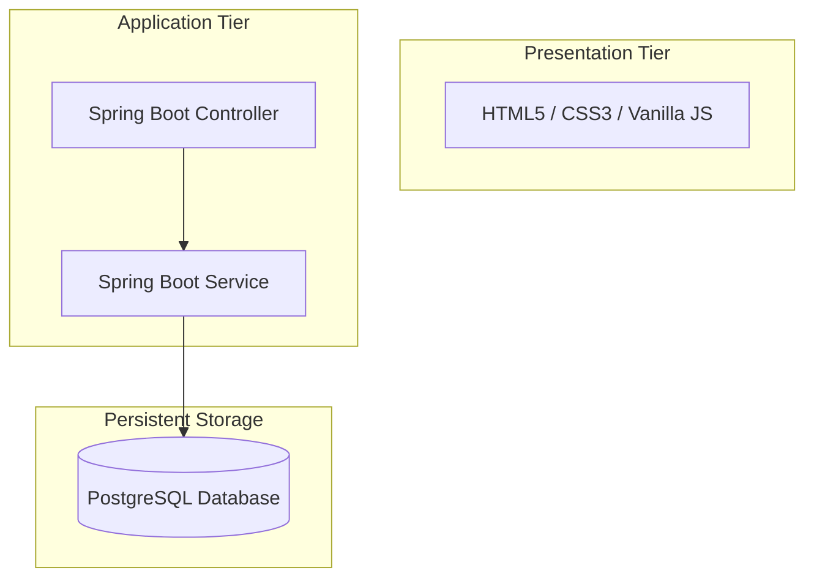

# Project Report: MediCare
## AI-Assisted Medical Appointment and Queue Management System

**Institution:** Hindalco Industries Limited (Internship Project)  
**Author:** Ajitesh Sharma  
**Duration:** 2026-06-01 to 2026-06-21  
**Repository:** [Appointment-system](https://github.com/AJ1312/Appointment-system)

---

## 1. Executive Summary
**MediCare** is a production-grade full-stack web platform designed to solve patient scheduling congestion, consultation bottlenecks, and long clinic wait times. Developed as a major project during a Hindalco Industries internship, the platform allows patients to register, search for medical specialists, book appointments, receive real-time queue tokens, and track their estimated wait times dynamically.

### Key Enhancements & New Features:
* **Asynchronous Email Notification Pipeline**: Automatic confirmation messages are sent on booking, security alerts are sent on successful logins (Patients, Doctors, and Admins), and update notifications are sent on scheduling adjustments.
* **Doctor Rescheduling Facility**: Built-in slot management for doctors to rearrange patient appointments dynamically based on availability.
* **Automated Dashboard Live Queue Tracking**: The patient dashboard now has a prominent "Live Queue Status" card on the main Overview page that updates every 5 seconds, eliminating manual lookup forms.

---

## 2. Technical Stack & Justifications
The application is built on modern web engineering standards chosen for speed, decoupling, and high scalability:

* **Presentation Tier**: HTML5, CSS3 Custom Properties, and Vanilla JS.
  * *Justification*: By avoiding heavy JS frameworks (like React or Angular), we achieved a zero-build-step frontend that loads instantaneously. Vanilla CSS variables (CSS Custom Properties) provide an elegant, cohesive dark-mode design system with smooth CSS micro-animations. Google Fonts (Inter) provides clean typography.
* **Application Tier**: Spring Boot 4.0, Java 21, Spring Data JPA, JavaMailSender.
  * *Justification*: Java 21 brings modern concurrency features. Spring Boot offers a robust, 3-tier layering separating REST Controllers, Service logic, and JPA Repositories. JavaMailSender facilitates quick integration with SMTP services, and Spring DevTools speeds up code updates.
* **Persistent Storage**: PostgreSQL 15.
  * *Justification*: A robust, ACID-compliant relational database. PostgreSQL efficiently manages 3NF relations between tables (specializations, doctors, appointments, queue positions) and ensures referential integrity via foreign key constraints.

---

## 3. System Architecture & Use Case
The application follows a clean **3-Tier Layered Architecture** separating presentation, business logic, and persistent storage layers:

### Layered Architecture Diagram


### System Use Case Diagram




---

## 4. Initial Scope & Requirements (SRS)

### 4.1 In-Scope Features
* **Patient Module**: Registration, login, profile management, view doctors/specializations, book consultations, and view queue token information.
* **Doctor Module**: Login, profile dashboard, view assigned appointments, update appointment status, and view patient queue statistics.
* **Admin Module**: Manage doctor profiles, patient accounts, clinical specializations, system-wide analytics, and live queue overviews.
* **Triage & Queue System**: Active queue token numbers, live position counters, and dynamic wait-time indicators.

### 4.2 Out-of-Scope Features
* Online payment processing gateways.
* In-app telemedicine video consultation rooms.
* Electronic Health Record (EHR) management.
* Insurance claim processing integrations.

### 4.3 Functional Requirements (FR)
* **User Management**:
  * **FR-1**: Allow patients to register an account.
  * **FR-2**: Allow patients to log in and out securely.
  * **FR-3**: Allow doctors to log in and access their dashboard.
  * **FR-4**: Allow administrators to log in and access administrative tools.
* **Patient Management**:
  * **FR-5**: Patients view/update profile information.
  * **FR-6**: Patients browse doctors by clinical specialization.
  * **FR-7**: Patients view individual doctor details.
* **Appointment Management**:
  * **FR-8**: Patients book appointments with available doctors.
  * **FR-9**: Patients cancel appointments.
  * **FR-10**: System stores appointment details in the database.
  * **FR-11**: Doctors view their scheduled appointments.
  * **FR-12**: Doctors update appointment status.
* **Queue Management**:
  * **FR-13**: System auto-generates a unique queue token for each appointment.
  * **FR-14**: System maintains order of patients in the queue.
  * **FR-15**: Patients view their queue position.
  * **FR-16**: System calculates estimated waiting times.
* **Administration**:
  * **FR-17**: Admins add, update, and remove doctor records.
  * **FR-18**: Admins manage specializations.
  * **FR-19**: Admins monitor appointments.
* **Notification Management**:
  * **FR-20**: System sends email confirmations after booking.
  * **FR-21**: System sends appointment status notifications.

### 4.4 Non-Functional Requirements (NFR)
* **Performance**:
  * **NFR-1**: Response time under 3 seconds.
  * **NFR-2**: Support multiple concurrent users.
* **Security**:
  * **NFR-3**: User passwords stored with SHA-256 secure hashing.
  * **NFR-4**: Only authenticated users access protected resources.
  * **NFR-5**: Role-based authorization implemented.
* **Reliability & Consistency**:
  * **NFR-6**: Data consistency maintained.
  * **NFR-7**: Appointment info persistent, no lost transactions.
* **Availability**:
  * **NFR-8**: Available 24/7 except scheduled maintenance.
* **Usability & Maintainability**:
  * **NFR-9**: Provide user-friendly, responsive interface.
  * **NFR-10**: Support modern web browsers (Chrome, Safari, Firefox).
  * **NFR-11**: Follow modular architecture for future enhancements.
  * **NFR-12**: Git version control for code changes.
* **Scalability**:
  * **NFR-13**: Support future integration of AI wait time prediction and doctor recommendation algorithms.

---

## 5. Security & Secret Management (SMTP Safe-Guards)
To comply with professional software engineering safety practices, **SMTP credentials are not hardcoded or checked into Git**:

1. **Ignored Configuration File**: Created a classpath resource `application-secret.properties` to house the username and SMTP password.
2. **Properties Import**: Added a dynamic configuration import rule inside `application.properties`:
   ```properties
   spring.config.import=optional:classpath:application-secret.properties
   ```
3. **Git Ignore Rule**: The pattern `**/application-secret.properties` is appended to `.gitignore`, preventing credentials from being staged.
4. **Git Purge**: Used soft resets to clear previous credential-bearing commits from version history, completing a force push to scrub history logs completely.

---

## 6. AI Feature & Triage Algorithms

### 6.1 Wait Time Prediction
* **Location**: `QueueService.predictWaitTime(doctorId)`
* **Algorithm Description**: Wait times are calculated using doctor-specific average consultation times, current waiting list length, and a dynamic load coefficient adjusting for queue congestion:

$$\text{Predicted Wait Time} = \text{Queue Length} \times \text{Average Consult Duration} \times \text{Load Factor}$$

Where:
* **Queue Length**: Count of waiting entries for the doctor on that date.
* **Average Consult Duration**: Default 15 minutes (configurable per doctor).
* **Load Factor**:
  * $1.0$ (when Queue Length $\le 5$)
  * $1.1$ (when Queue Length $\le 10$)
  * $1.2$ (when Queue Length $> 10$, modelling delay overheads)

---

### 6.2 NLP Triage & Specialty Recommender
* **Location**: `DoctorService.runTriageAnalysis(symptoms)`
* **Algorithm Description**: Regular expression keyword mapping matches patient-described symptoms directly to corresponding specialties and priority levels:

| Keyword Patterns | Specialization | Priority Level | Suggested Triage Action |
| :--- | :--- | :--- | :--- |
| `chest`, `heart`, `cardiac`, `palpitation` | Cardiology | High | Immediate specialist booking |
| `seizure`, `stroke`, `headache`, `neuro` | Neurology | High / Medium | Book neurological consultation |
| `fracture`, `broken bone`, `ortho`, `joint` | Orthopedics | High / Medium | Orthopedic consultation soon |
| `skin`, `rash`, `acne`, `derma` | Dermatology | Low | Schedule standard appointment |
| `child`, `infant`, `pediatric` | Pediatrics | Medium | Schedule pediatric appointment |
| `eye`, `vision`, `ophthal` | Ophthalmology | Medium | Standard vision exam |
| `teeth`, `dental`, `tooth` | Dentistry | Medium | Dental appointment |
| `stomach`, `gastro`, `digestion` | Gastroenterology | Medium | Digestive checkup |
| `kidney`, `bladder`, `urology` | Urology | Medium | Urology consult |
| *No Match / General Symptoms* | General Medicine | Low | Primary care consultation |

---

## 7. Database Schema Design (3NF)
All PostgreSQL tables are fully normalized to the Third Normal Form (3NF) to eliminate transitive dependencies and update anomalies:

### Entity-Relationship Diagram (ERD)


```
specialization (1) ─── (N) doctor
patient        (1) ─── (N) appointment
doctor         (1) ─── (N) appointment
appointment    (1) ─── (1) queue_entry
doctor         (1) ─── (N) doctor_availability
```

### Table Dictionary:
1. `specialization`: List of clinical specialties.
2. `doctor`: Healthcare provider details.
3. `patient`: Registered patient profile data.
4. `admin`: Administrative dashboard user.
5. `appointment`: Booking transactions, diagnosis notes, and triage flags.
6. `queue_entry`: Live queue positions, wait predictions, and status.
7. `doctor_availability`: Doctor time slot configurations.

---

## 8. System Walkthrough & Screenshots

### 8.1 Landing Page (`index.html`)

*Medicare landing page showing system benefits, live statistic mockups, and symptom search recommendations.*

### 8.2 Patient Registration (`register.html`)

*Secure registration form gathering name, email, phone number, gender, date of birth, and password.*

### 8.3 Sign In Portal (`login.html`)

*Unified sign-in interface allowing role selection (Patient/Doctor/Admin) with tab switches.*

### 8.4 Patient Overview Dashboard (`dashboard.html`)

*Initial overview screen indicating system statistics and recent consultation logs.*

### 8.5 Automated Live Queue Card

*Overview dashboard with the automated Live Queue Status card that updates every 5 seconds.*

### 8.6 Doctor Appointments & Actions (`doctor.html`)

*Doctor portal displaying active consultations, triage alerts, and diagnostic controls.*

### 6.7 Doctor Reschedule Modal

*Rescheduling window displaying slot availabilities. Confirming frees the previous slot and updates the queue.*

### 8.8 System Admin Dashboard (`admin.html`)

*Control panel for platform administrators showing system analytics, doctor registration, and queue oversight.*

---

## 9. Software Engineering Best Practices
* **Single Responsibility Principle (SRP)**: Separated REST endpoints, service orchestration, database mapping, and mail dispatch into independent layers.
* **DRY (Don't Repeat Yourself)**: Shared utilities (formatting, API handling) centralized in `app.js`.
* **CORS Middleware**: Dynamic configurations allowed secure cross-origin HTTP operations from localhost:3000 to localhost:8080.
* **Global Exception Advice**: Unified error responses prevent backend stack traces from being exposed to the client.

---

## 10. Conclusion
MediCare successfully resolves clinic wait inefficiencies by merging scheduling, queue optimization, and automated communications. The rule-based NLP triage and predicted wait time algorithm provide automated primary routing. Completed during a Hindalco internship, this platform establishes a standard framework for modern, patient-first clinical queue tracking.
