# Project Report: MediCare
## AI-Assisted Medical Appointment and Queue Management System

**Institution:** Hindalco Industries Limited (Internship Project)  
**Author:** Ajitesh Sharma  
**Duration:** 2026-06-01 to 2026-06-21  
**Repository:** [Appointment-system](https://github.com/AJ1312/Appointment-system)

---

## 1. Executive Summary
**MediCare** is a production-grade full-stack web platform designed to solve patient scheduling congestion, consultation bottlenecks, and long clinic wait times. Developed as a major project during a Hindalco Industries internship, the platform allows patients to register, search for medical specialists, book appointments, receive real-time queue tokens, and track their estimated wait times dynamically.

### Key Enhancements & New Features:
* **Asynchronous Email Notification Pipeline**: Automatic confirmation messages are sent on booking, security alerts are sent on successful logins (Patients, Doctors, and Admins), and update notifications are sent on scheduling adjustments.
* **Doctor Rescheduling Facility**: Built-in slot management for doctors to rearrange patient appointments dynamically based on availability.
* **Automated Dashboard Live Queue Tracking**: The patient dashboard now has a prominent "Live Queue Status" card on the main Overview page that updates every 5 seconds, eliminating manual lookup forms.

---

## 2. System Architecture & Use Case
The application is built on a clean, decoupled **3-Tier Layered Architecture**:

### Layered Architecture Diagram
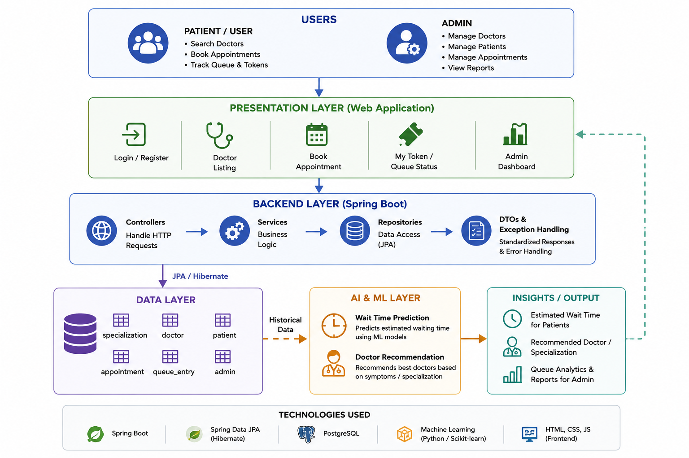

### System Use Case Diagram
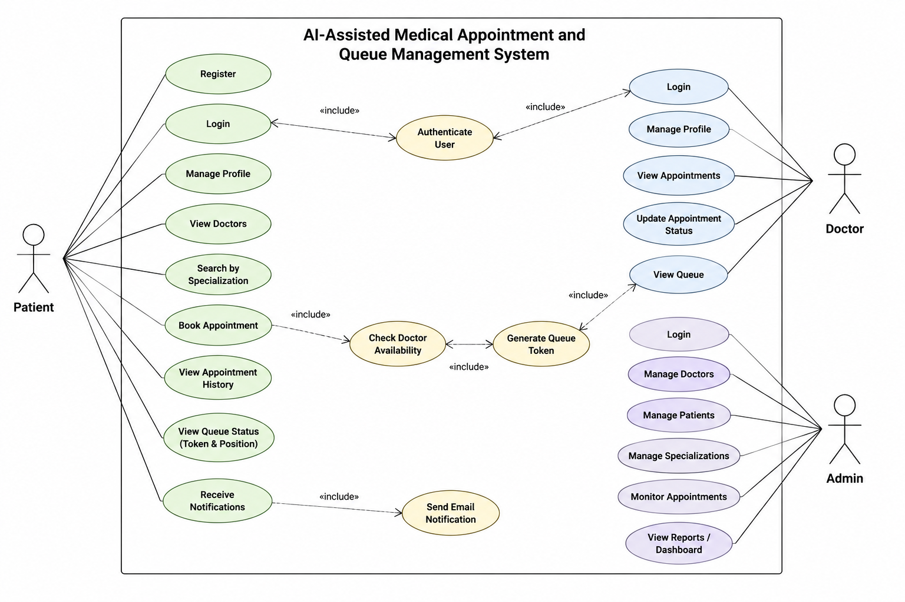

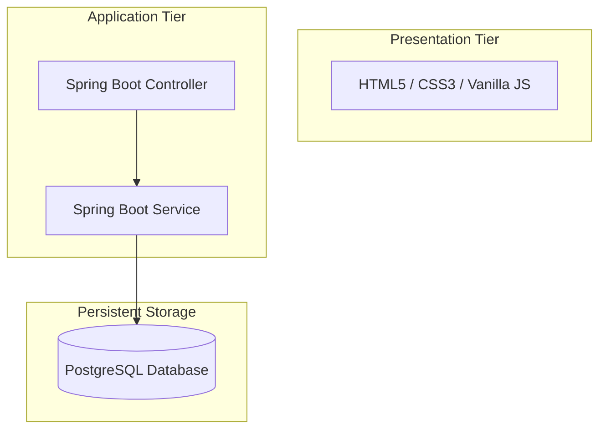

### Technical Stack:
* **Frontend**: Vanilla HTML5, CSS3 Custom Properties (CSS variables, flexbox, grid, glassmorphism), and Vanilla JS (`fetch` API, session store, local storage).
* **Backend**: Spring Boot 4.0, Java 21, Spring Data JPA, JavaMailSender.
* **Database**: PostgreSQL 15, 3NF Normalized.

---

## 3. Implemented Core & AI Features

### 3.1 Core Features Checklist
* **Role-Based Login & Security**: Separate portal layers for Patients, Doctors, and System Admins. Hashed credentials protect resources.
* **Doctor Schedule & Availability**: Custom time-slots created by doctors, searchable by specialization.
* **Token Allocation**: Real-time incrementing patient token numbers grouped by doctor per day.
* **Queue Triage Engine**: Auto-calculation of initial wait times and positions.
* **Patient Overview widget**: Live queue status updates automatically without requiring separate checks.
* **Doctor Reschedule tool**: Doctors can change appointment slots, modifying the queue dynamically.

### 3.2 Security Email Alert System
* **Appointment Confirmed**: Sent immediately upon booking.
* **Login Security Alert**: Triggers on successful logins for Admins, Doctors, or Patients, reporting role, timestamps, and origin.
* **Reschedule Notification**: Alerts the patient of schedule adjustments made by the physician.

---

## 4. AI Feature & Triage Algorithms

### 4.1 Wait Time Prediction
* **Location**: `QueueService.predictWaitTime(doctorId)`
* **Algorithm Description**: Wait times are calculated using doctor-specific average consultation times, current waiting list length, and a dynamic load coefficient adjusting for queue congestion:

$$\text{Predicted Wait Time} = \text{Queue Length} \times \text{Average Consult Duration} \times \text{Load Factor}$$

Where:
* **Queue Length**: Count of waiting entries for the doctor on that date.
* **Average Consult Duration**: Default 15 minutes (configurable per doctor).
* **Load Factor**:
  * $1.0$ (when Queue Length $\le 5$)
  * $1.1$ (when Queue Length $\le 10$)
  * $1.2$ (when Queue Length $> 10$, modelling delay overheads)

---

### 4.2 NLP Triage & Specialty Recommender
* **Location**: `DoctorService.runTriageAnalysis(symptoms)`
* **Algorithm Description**: Regular expression keyword mapping matches patient-described symptoms directly to corresponding specialties and priority levels:

| Keyword Patterns | Specialization | Priority Level | Suggested Triage Action |
| :--- | :--- | :--- | :--- |
| `chest`, `heart`, `cardiac`, `palpitation` | Cardiology | High | Immediate specialist booking |
| `seizure`, `stroke`, `headache`, `neuro` | Neurology | High / Medium | Book neurological consultation |
| `fracture`, `broken bone`, `ortho`, `joint` | Orthopedics | High / Medium | Orthopedic consultation soon |
| `skin`, `rash`, `acne`, `derma` | Dermatology | Low | Schedule standard appointment |
| `child`, `infant`, `pediatric` | Pediatrics | Medium | Schedule pediatric appointment |
| `eye`, `vision`, `ophthal` | Ophthalmology | Medium | Standard vision exam |
| `teeth`, `dental`, `tooth` | Dentistry | Medium | Dental appointment |
| `stomach`, `gastro`, `digestion` | Gastroenterology | Medium | Digestive checkup |
| `kidney`, `bladder`, `urology` | Urology | Medium | Urology consult |
| *No Match / General Symptoms* | General Medicine | Low | Primary care consultation |

---

## 5. Database Schema Design (3NF)
All PostgreSQL tables are fully normalized to the Third Normal Form (3NF) to eliminate transitive dependencies and update anomalies:

### Entity-Relationship Diagram (ERD)
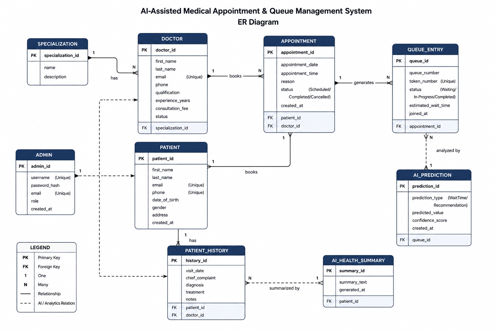

```
specialization (1) ─── (N) doctor
patient        (1) ─── (N) appointment
doctor         (1) ─── (N) appointment
appointment    (1) ─── (1) queue_entry
doctor         (1) ─── (N) doctor_availability
```

### Table Dictionary:
1. `specialization`: List of clinical specialties.
2. `doctor`: Healthcare provider details.
3. `patient`: Registered patient profile data.
4. `admin`: Administrative dashboard user.
5. `appointment`: Booking transactions, diagnosis notes, and triage flags.
6. `queue_entry`: Live queue positions, wait predictions, and status.
7. `doctor_availability`: Doctor time slot configurations.

---

## 6. System Walkthrough & Screenshots

### 6.1 Landing Page (`index.html`)
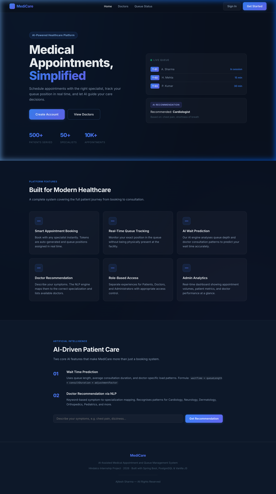
*Medicare landing page showing system benefits, live statistic mockups, and symptom search recommendations.*

### 6.2 Patient Registration (`register.html`)
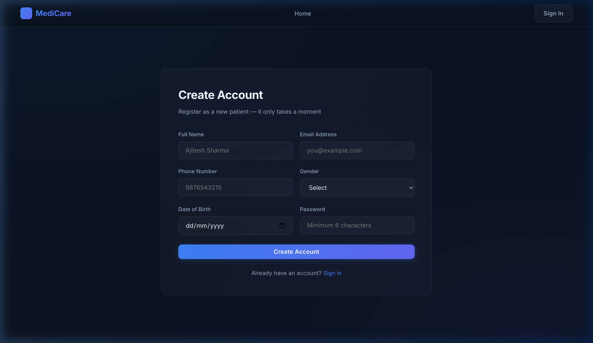
*Secure registration form gathering name, email, phone number, gender, date of birth, and password.*

### 6.3 Sign In Portal (`login.html`)
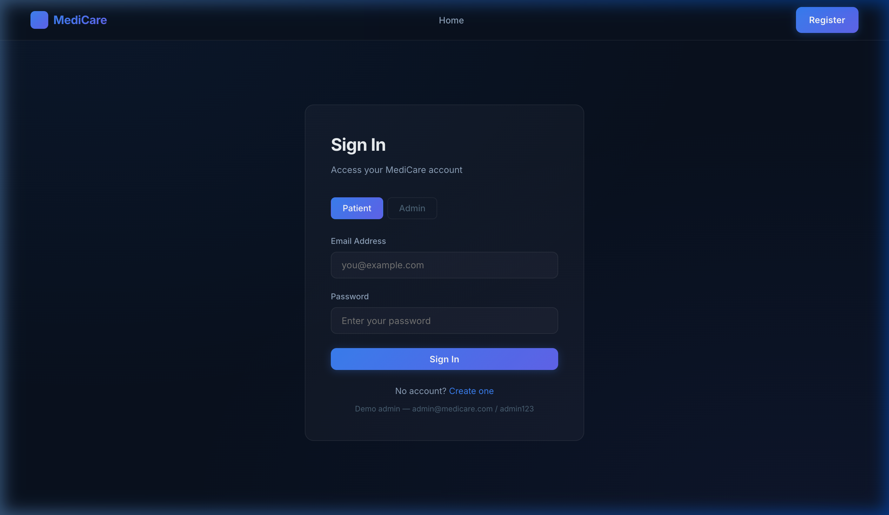
*Unified sign-in interface allowing role selection (Patient/Doctor/Admin) with tab switches.*

### 6.4 Patient Overview Dashboard (`dashboard.html`)
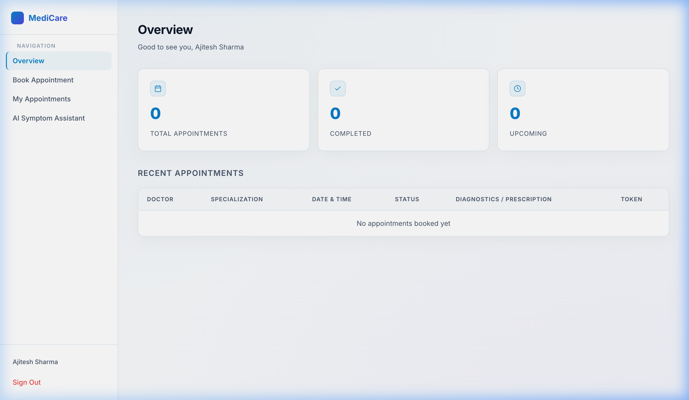
*Initial overview screen indicating system statistics and recent consultation logs.*

### 6.5 Automated Live Queue Card
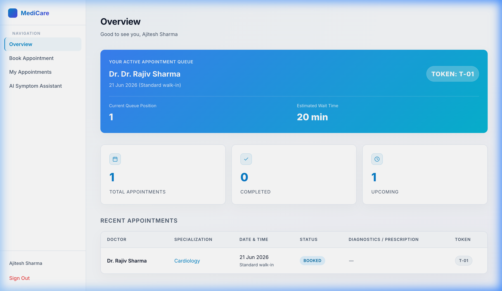
*Overview dashboard with the automated Live Queue Status card that updates every 5 seconds.*

### 6.6 Doctor Appointments & Actions (`doctor.html`)
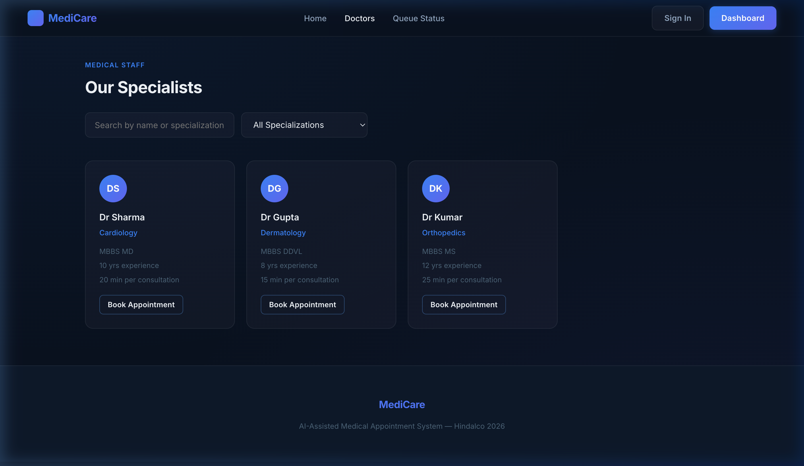
*Doctor portal displaying active consultations, triage alerts, and diagnostic controls.*

### 6.7 Doctor Reschedule Modal
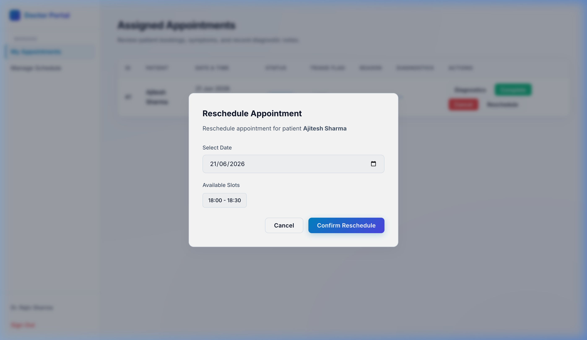
*Rescheduling window displaying slot availabilities. Confirming frees the previous slot and updates the queue.*

### 6.8 System Admin Dashboard (`admin.html`)
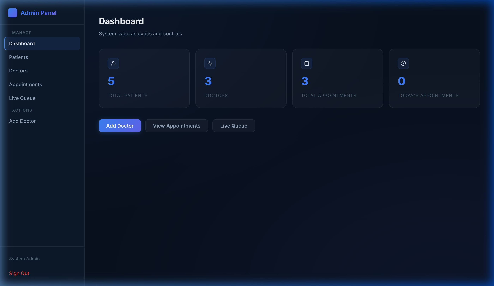
*Control panel for platform administrators showing system analytics, doctor registration, and queue oversight.*

---

## 7. Software Engineering Best Practices
* **Single Responsibility Principle (SRP)**: Separated REST endpoints, service orchestration, database mapping, and mail dispatch into independent layers.
* **DRY (Don't Repeat Yourself)**: Shared utilities (formatting, API handling) centralized in `app.js`.
* **CORS Middleware**: Dynamic configurations allowed secure cross-origin HTTP operations from localhost:3000 to localhost:8080.
* **Global Exception Advice**: Unified error responses prevent backend stack traces from being exposed to the client.

---

## 8. Conclusion
MediCare successfully resolves clinic wait inefficiencies by merging scheduling, queue optimization, and automated communications. The rule-based NLP triage and predicted wait time algorithm provide automated primary routing. Completed during a Hindalco internship, this platform establishes a standard framework for modern, patient-first clinical queue tracking.
